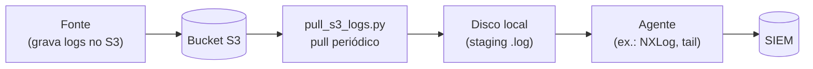

# pull-logs-s3

Pequeno utilitário para fazer o **pull de logs de um bucket S3** para um
diretório local, de onde um agente (NXLog, Filebeat, etc.) encaminha para o
SIEM.

A lógica é **agnóstica de tecnologia**: serve para qualquer fonte que entregue
logs num bucket S3 (CDNs, WAFs, serviços de nuvem...). Basta apontar o bucket,
os caminhos e o agente de saída. O exemplo de agente incluído usa **NXLog**.

## A ideia

Muitas plataformas não mandam log direto pro SIEM — elas depositam os arquivos
num bucket S3 (geralmente compactados em `.gz`). Esse utilitário fecha esse vão:



1. **S3** — a fonte grava os logs, normalmente organizados por data.
2. **Script Python** — baixa os arquivos novos. Se o objeto vier **compactado
   (`.gz`)**, descompacta para `.log`; se já vier em **texto (`.log`)**, baixa
   direto. Roda em loop (ou uma vez só).
3. **Disco local** — área de "staging". O agente observa essa pasta.
4. **Agente (ex.: NXLog)** — faz o *tail* dos `.log` e manda pro SIEM.
5. **SIEM** — recebe tudo e indexa.

A limpeza dos arquivos já processados pode ficar por conta do agente. No exemplo
de NXLog incluído aqui, há um agendamento que apaga `.gz` e `.log` antigos, então
o disco não enche.

## Arquivos

| Arquivo | Para que serve |
|---|---|
| `pull_s3_logs.py` | Faz o pull do S3: baixa e (se preciso) descompacta os logs. |
| `nxlog.conf` | **Exemplo** de agente (NXLog Community Edition) lendo os logs e enviando ao SIEM. |
| `.env.example` | Modelo das variáveis de ambiente. Copie para `.env` e ajuste. |
| `requirements.txt` | Dependências Python (só o `boto3`). |

> O `nxlog.conf` é só um exemplo de saída. Se você usa outro agente (Filebeat,
> Fluent Bit, Winlogbeat...), basta apontá-lo para a mesma pasta de staging — a
> parte do pull não muda.

## Pré-requisitos (importante)

Para a coleta funcionar, a máquina precisa de:

1. **Python 3.9+** e o `boto3` (veja `requirements.txt`).
2. **AWS CLI instalado** na máquina, com um par **Access Key / Secret Key**
   configurado. Essas credenciais precisam ter **permissão de leitura no
   bucket S3** (`s3:ListBucket` e `s3:GetObject`). Sem isso o script não
   consegue listar nem baixar os logs.

A forma mais simples de configurar as credenciais é via AWS CLI:

```powershell
aws configure
# AWS Access Key ID:     <sua access key>
# AWS Secret Access Key: <sua secret key>
# Default region name:   us-east-1
```

Isso grava as credenciais em `%USERPROFILE%\.aws\credentials`, e o `boto3`
as lê automaticamente — não é preciso colocar chave nenhuma no código.

> Recomendação de segurança: dê à chave **somente leitura** no bucket de logs.
> Em ambientes AWS (EC2, etc.) o ideal é usar uma **IAM Role** no lugar da
> chave estática.

## Como rodar o script

```powershell
# 1. Instalar dependências
pip install -r requirements.txt

# 2. Configurar credenciais da AWS (uma vez)
aws configure

# 3. Configurar o script (copie e edite com seus valores)
copy .env.example .env

# 4. Carregar as variáveis e rodar
#    (em produção, isso normalmente vai num serviço / Agendador de Tarefas)
python pull_s3_logs.py          # loop contínuo
python pull_s3_logs.py --once   # só um ciclo, útil pra testar
```

A configuração do script (bucket, caminhos, intervalo) vem toda de variáveis de
ambiente — nada fica embutido no código.

## Exemplo de agente: NXLog

O `nxlog.conf` é compatível com a **Community Edition**. Antes de usar, ajuste
os `define` no topo do arquivo:

- `SIEM_HOST`, `SIEM_PORT_WINEVT`, `SIEM_PORT_S3` — destino do SIEM.
- `STAGING_DIR` — a mesma pasta onde o script Python solta os `.log` (= `PULL_BASE_DIR`).

Coloque o arquivo em `C:\Program Files\nxlog\conf\nxlog.conf` (ou ajuste o
caminho da sua instalação) e reinicie o serviço do NXLog.

## Observações de segurança

- Todos os IPs, portas, nome de bucket e caminhos nos arquivos são **exemplos
  genéricos**. Troque pelos valores reais só no seu `.env` / na sua instalação.
- `.env`, arquivos de log e os próprios logs baixados estão no `.gitignore`.

## Licença

Distribuído sob a licença **MIT**. Veja o arquivo [`LICENSE`](LICENSE).
