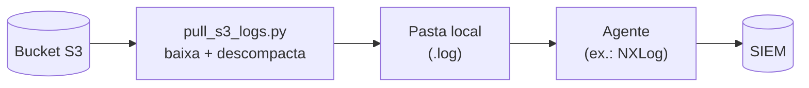

# pull-logs-s3

## O que é

Um script Python que **puxa logs de um bucket S3** e deixa eles numa pasta
local. Dali, um agente (NXLog, Filebeat, etc.) lê os arquivos e manda pro SIEM.

Serve para qualquer fonte que jogue logs num bucket S3 (CDN, WAF, serviços de
nuvem...). O exemplo de agente que acompanha o projeto usa NXLog.

## O que faz

- Lista os objetos novos do bucket (a partir do dia atual).
- Baixa o que ainda não pegou. Se vier **compactado (`.gz`)**, descompacta para
  `.log`; se já vier em **texto (`.log`)**, baixa direto.
- Guarda os `.log` numa pasta de staging, que o agente fica observando.
- Roda em loop (de tempos em tempos) ou só uma vez (`--once`).

Ele não reprocessa o que já baixou e trata erros sem derrubar o processo.

## Como funciona



## Como instalar

**Você precisa de:** Python 3.9+, e uma credencial AWS com **leitura** no bucket
(`s3:ListBucket` e `s3:GetObject`). O jeito mais fácil de configurar a credencial
é `aws configure` (ou colocar `AWS_ACCESS_KEY_ID`/`AWS_SECRET_ACCESS_KEY` no
`.env`).

```bash
# 1. Dependências
pip install -r requirements.txt

# 2. Configuração: copie o modelo e ajuste bucket e caminhos
cp .env.example .env        # Windows: copy .env.example .env

# 3. Rodar
python pull_s3_logs.py          # loop contínuo
python pull_s3_logs.py --once   # uma vez só (bom pra testar)
```

O script lê o `.env` da própria pasta automaticamente. As principais variáveis:

| Variável | Para que serve |
|---|---|
| `S3_BUCKET` | nome do bucket |
| `PULL_BASE_DIR` | onde os `.gz` baixados ficam |
| `PULL_LOG_DIR` | onde os `.log` ficam — **é essa pasta que o agente lê** |
| `PULL_INTERVAL_SECONDS` | intervalo entre os ciclos do loop |

> O agente é só a "última milha". O exemplo usa NXLog (`nxlog.conf`), mas pode
> ser Filebeat, Fluent Bit, etc. — é só apontar pra mesma pasta dos `.log`.

## Rodando como serviço (sugestão)

Pra coleta contínua, o ideal é deixar isso como serviço, pra subir no boot e
reiniciar sozinho. Não é obrigatório — dá pra rodar manual ou via agendador.
Alguns exemplos:

**Linux (systemd)** — `/etc/systemd/system/pull-logs-s3.service`:

```ini
[Service]
User=pull-logs
WorkingDirectory=/opt/pull-logs-s3
ExecStart=/opt/pull-logs-s3/.venv/bin/python /opt/pull-logs-s3/pull_s3_logs.py
Restart=always

[Install]
WantedBy=multi-user.target
```

```bash
sudo systemctl enable --now pull-logs-s3
```

**Windows** — como serviço com [NSSM](https://nssm.cc/):

```powershell
nssm install pull-logs-s3 "C:\Program Files\Python313\python.exe" "C:\Program Files\pull-logs-s3\pull_s3_logs.py"
nssm start pull-logs-s3
```

Ou, sem instalar nada, uma tarefa no **Agendador** com gatilho "ao iniciar o
computador". Se preferir não manter processo vivo, agende o `--once` a cada X
minutos (cron no Linux, Agendador no Windows).

## Dica de segurança (recomendado)

Como o script pode rodar com privilégio e o `.env` pode ter chave AWS, vale a
pena se proteger de dois problemas: alguém **trocar o script** ou **ler o
`.env`**. Sugestões simples:

- **Coloque o código numa pasta que usuário comum não altere** — Windows:
  `C:\Program Files\...` (já tem ACL forte); Linux: `/opt/...` com dono `root`.
- **Restrinja o `.env`** — Linux: `chmod 640 .env`; Windows: ACL liberando
  leitura só pra Admin/SYSTEM e a conta do serviço.
- **Rode com conta de baixo privilégio** — evite `LocalSystem` (Windows) ou
  `root` (Linux); use uma conta dedicada só pra isso.

No Linux, o script ainda avisa no log se o `.env` estiver com permissão frouxa.

## Licença

MIT — veja o arquivo [`LICENSE`](LICENSE).
