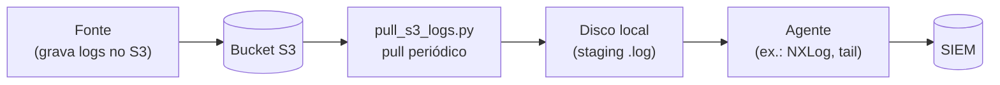
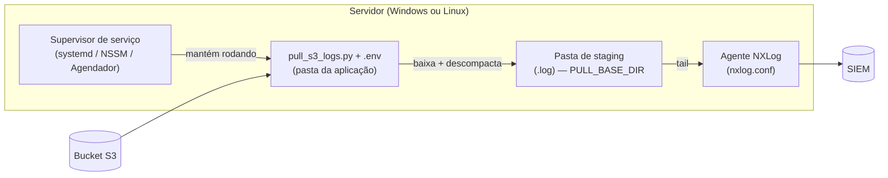
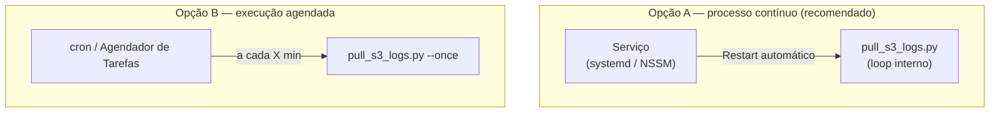

# pull-logs-s3

Pequeno utilitário para fazer o **pull de logs de um bucket S3** para um
diretório local, de onde um agente (NXLog, Filebeat, etc.) encaminha para o
SIEM.

A lógica é **agnóstica de tecnologia**: serve para qualquer fonte que entregue
logs num bucket S3 (CDNs, WAFs, serviços de nuvem...). Basta apontar o bucket,
os caminhos e o agente de saída. O exemplo de agente incluído usa **NXLog**.

## A ideia

Muitas plataformas não mandam log direto pro SIEM — elas depositam os arquivos
num bucket S3 (geralmente compactados em `.gz`). Esse utilitário fecha esse vão:



1. **S3** — a fonte grava os logs, normalmente organizados por data.
2. **Script Python** — baixa os arquivos novos. Se o objeto vier **compactado
   (`.gz`)**, descompacta para `.log`; se já vier em **texto (`.log`)**, baixa
   direto. Roda em loop (ou uma vez só).
3. **Disco local** — área de "staging". O agente observa essa pasta.
4. **Agente (ex.: NXLog)** — faz o *tail* dos `.log` e manda pro SIEM.
5. **SIEM** — recebe tudo e indexa.

A limpeza dos arquivos já processados pode ficar por conta do agente. No exemplo
de NXLog incluído aqui, há um agendamento que apaga `.gz` e `.log` antigos, então
o disco não enche.

## Arquivos

| Arquivo | Para que serve |
|---|---|
| `pull_s3_logs.py` | Faz o pull do S3: baixa e (se preciso) descompacta os logs. |
| `nxlog.conf` | **Exemplo** de agente (NXLog Community Edition) lendo os logs e enviando ao SIEM. |
| `.env.example` | Modelo das variáveis de ambiente. Copie para `.env` e ajuste. |
| `requirements.txt` | Dependências Python (só o `boto3`). |

> O `nxlog.conf` é só um exemplo de saída. Se você usa outro agente (Filebeat,
> Fluent Bit, Winlogbeat...), basta apontá-lo para a mesma pasta de staging — a
> parte do pull não muda.

## Pré-requisitos (importante)

Para a coleta funcionar, a máquina precisa de:

1. **Python 3.9+** e o `boto3` (veja `requirements.txt`).
2. **AWS CLI instalado** na máquina, com um par **Access Key / Secret Key**
   configurado. Essas credenciais precisam ter **permissão de leitura no
   bucket S3** (`s3:ListBucket` e `s3:GetObject`). Sem isso o script não
   consegue listar nem baixar os logs.

A forma mais simples de configurar as credenciais é via AWS CLI:

```bash
aws configure
# AWS Access Key ID:     <sua access key>
# AWS Secret Access Key: <sua secret key>
# Default region name:   us-east-1
```

Isso grava as credenciais em `~/.aws/credentials` (no Windows,
`%USERPROFILE%\.aws\credentials`), e o `boto3` as lê automaticamente — não é
preciso colocar chave nenhuma no código.

> Recomendação de segurança: dê à chave **somente leitura** no bucket de logs.
> Em ambientes AWS (EC2, etc.) o ideal é usar uma **IAM Role** no lugar da
> chave estática.

## Como rodar (teste rápido)

```bash
# 1. Instalar dependências
pip install -r requirements.txt

# 2. Configurar credenciais da AWS (uma vez)
aws configure

# 3. Copiar o modelo de configuração e ajustar os valores
cp .env.example .env        # no Windows: copy .env.example .env

# 4. Rodar
python pull_s3_logs.py          # loop contínuo
python pull_s3_logs.py --once   # só um ciclo, útil pra testar
```

O script **carrega automaticamente** o `.env` que estiver **na mesma pasta dele**
(ou aponte outro com `--env-file`). Variáveis já definidas no sistema/serviço têm
prioridade sobre o arquivo.

## Onde fica cada coisa (deploy)

A pergunta mais comum: "onde coloco o quê?". A regra é simples — **o script e o
`.env` ficam juntos**, numa pasta da aplicação; o resto é configurável pelo
`.env`.



Sugestão de caminhos (você ajusta no `.env`):

**Linux**

| Item | Caminho sugerido |
|---|---|
| Script + `.env` | `/opt/pull-logs-s3/` |
| Staging dos `.log` | `/var/log/pull-logs-s3/Logs/` (com `PULL_BASE_DIR=/var/log/pull-logs-s3`) |
| Log de execução | `/var/log/pull-logs-s3/sync_execution.log` |
| `nxlog.conf` | `/etc/nxlog/nxlog.conf` |
| Credenciais AWS | `~/.aws/credentials` (do usuário que roda o serviço) |

**Windows**

| Item | Caminho sugerido |
|---|---|
| Script + `.env` | `C:\Apps\pull-logs-s3\` |
| Staging dos `.log` | `D:\Logs\Logs\` (com `PULL_BASE_DIR=D:\Logs`) |
| Log de execução | `C:\LogFiles\pull-logs-s3\sync_execution.log` |
| `nxlog.conf` | `C:\Program Files\nxlog\conf\nxlog.conf` |
| Credenciais AWS | `%USERPROFILE%\.aws\credentials` |

> **Onde os logs são salvos?** Tudo sai de `PULL_BASE_DIR`: os `.gz` baixados vão
> pra ela, e os `.log` prontos vão pra `PULL_LOG_DIR` (por padrão, a subpasta
> `Logs/`). É essa pasta `Logs/` que o agente observa. As variáveis estão no
> `.env.example`.

## Execução contínua e persistência

A coleta é contínua, então você quer que ela **suba sozinha no boot** e
**reinicie se cair**. Há duas formas:



### Linux — serviço systemd (Opção A)

Crie `/etc/systemd/system/pull-logs-s3.service`:

```ini
[Unit]
Description=pull-logs-s3 — coletor de logs do S3
Wants=network-online.target
After=network-online.target

[Service]
Type=simple
User=pull-logs
WorkingDirectory=/opt/pull-logs-s3
ExecStart=/opt/pull-logs-s3/.venv/bin/python /opt/pull-logs-s3/pull_s3_logs.py
Restart=always
RestartSec=10

[Install]
WantedBy=multi-user.target
```

```bash
sudo systemctl daemon-reload
sudo systemctl enable --now pull-logs-s3   # habilita no boot e inicia
journalctl -u pull-logs-s3 -f              # acompanhar os logs
```

O `.env` é lido automaticamente de `/opt/pull-logs-s3/.env`. As credenciais AWS
devem estar acessíveis ao usuário `pull-logs` (`~/.aws/credentials`) ou via
`AWS_*` no próprio `.env`.

### Windows — serviço (Opção A)

A forma mais limpa é registrar como serviço com o **NSSM**
(*Non-Sucking Service Manager*):

```powershell
nssm install pull-logs-s3 "C:\Python313\python.exe" "C:\Apps\pull-logs-s3\pull_s3_logs.py"
nssm set pull-logs-s3 AppDirectory "C:\Apps\pull-logs-s3"
nssm start pull-logs-s3
```

Como serviço, ele sobe no boot e reinicia sozinho. Alternativa sem instalar nada:
**Agendador de Tarefas** → nova tarefa com gatilho *"Ao iniciar o computador"*,
marcando *"Executar estando o usuário conectado ou não"*, e ação chamando o
`python.exe` com o script.

### Opção B — agendado (cron / Agendador)

Se preferir não manter processo vivo, rode `--once` periodicamente:

- **Linux (cron):** `*/5 * * * * /opt/pull-logs-s3/.venv/bin/python /opt/pull-logs-s3/pull_s3_logs.py --once`
- **Windows:** uma tarefa no Agendador repetindo a cada X minutos, chamando
  `python pull_s3_logs.py --once`.

## Exemplo de agente: NXLog

O `nxlog.conf` é compatível com a **Community Edition**. Antes de usar, ajuste
os `define` no topo do arquivo:

- `SIEM_HOST`, `SIEM_PORT_WINEVT`, `SIEM_PORT_S3` — destino do SIEM.
- `STAGING_DIR` — a mesma pasta onde o script Python solta os `.log` (= `PULL_BASE_DIR`).

Onde colocar o arquivo:

- **Windows:** `C:\Program Files\nxlog\conf\nxlog.conf`
- **Linux:** `/etc/nxlog/nxlog.conf`

Depois de editar, reinicie o serviço do NXLog (`Restart-Service nxlog` no Windows
ou `sudo systemctl restart nxlog` no Linux).

## Observações de segurança

- Todos os IPs, portas, nome de bucket e caminhos nos arquivos são **exemplos
  genéricos**. Troque pelos valores reais só no seu `.env` / na sua instalação.
- `.env`, arquivos de log e os próprios logs baixados estão no `.gitignore`.

## Licença

Distribuído sob a licença **MIT**. Veja o arquivo [`LICENSE`](LICENSE).
