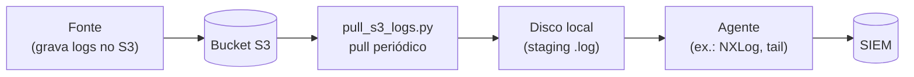
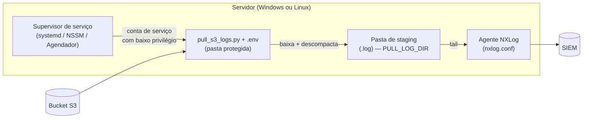
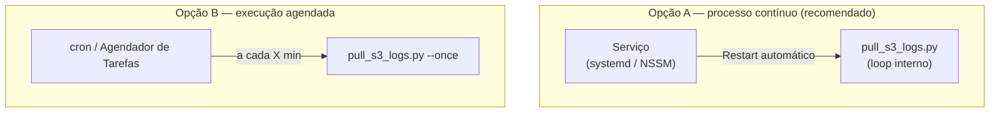

# pull-logs-s3

Pequeno utilitário para fazer o **pull de logs de um bucket S3** para um
diretório local, de onde um agente (NXLog, Filebeat, etc.) encaminha para o
SIEM.

A lógica é **agnóstica de tecnologia**: serve para qualquer fonte que entregue
logs num bucket S3 (CDNs, WAFs, serviços de nuvem...). Basta apontar o bucket,
os caminhos e o agente de saída. O exemplo de agente incluído usa **NXLog**.

## A ideia

Muitas plataformas não mandam log direto pro SIEM — elas depositam os arquivos
num bucket S3 (geralmente compactados em `.gz`). Esse utilitário fecha esse vão:



1. **S3** — a fonte grava os logs, normalmente organizados por data.
2. **Script Python** — baixa os arquivos novos. Se o objeto vier **compactado
   (`.gz`)**, descompacta para `.log`; se já vier em **texto (`.log`)**, baixa
   direto. Roda em loop (ou uma vez só).
3. **Disco local** — área de "staging". O agente observa essa pasta.
4. **Agente (ex.: NXLog)** — faz o *tail* dos `.log` e manda pro SIEM.
5. **SIEM** — recebe tudo e indexa.

A limpeza dos arquivos já processados pode ficar por conta do agente. No exemplo
de NXLog incluído aqui, há um agendamento que apaga `.gz` e `.log` antigos, então
o disco não enche.

## Arquivos

| Arquivo | Para que serve |
|---|---|
| `pull_s3_logs.py` | Faz o pull do S3: baixa e (se preciso) descompacta os logs. |
| `nxlog.conf` | **Exemplo** de agente (NXLog Community Edition) lendo os logs e enviando ao SIEM. |
| `.env.example` | Modelo das variáveis de ambiente. Copie para `.env` e ajuste. |
| `requirements.txt` | Dependências Python (só o `boto3`). |

> O `nxlog.conf` é só um exemplo de saída. Se você usa outro agente (Filebeat,
> Fluent Bit, Winlogbeat...), basta apontá-lo para a mesma pasta de staging — a
> parte do pull não muda.

## Pré-requisitos (importante)

Para a coleta funcionar, a máquina precisa de:

1. **Python 3.9+** e o `boto3` (veja `requirements.txt`).
2. **AWS CLI instalado** na máquina, com um par **Access Key / Secret Key**
   configurado. Essas credenciais precisam ter **permissão de leitura no
   bucket S3** (`s3:ListBucket` e `s3:GetObject`). Sem isso o script não
   consegue listar nem baixar os logs.

A forma mais simples de configurar as credenciais é via AWS CLI:

```bash
aws configure
# AWS Access Key ID:     <sua access key>
# AWS Secret Access Key: <sua secret key>
# Default region name:   us-east-1
```

Isso grava as credenciais em `~/.aws/credentials` (no Windows,
`%USERPROFILE%\.aws\credentials`), e o `boto3` as lê automaticamente — não é
preciso colocar chave nenhuma no código.

> **Atenção:** o `aws configure` grava no perfil do **usuário atual**. Quando o
> script roda como **serviço** (conta dedicada, sem perfil), o caminho mais
> simples e seguro é colocar `AWS_ACCESS_KEY_ID` / `AWS_SECRET_ACCESS_KEY` no
> próprio `.env` (que vamos trancar logo abaixo), ou usar uma **IAM Role** se
> estiver em EC2. Dê à chave **somente leitura** no bucket.

## Como rodar (teste rápido)

```bash
# 1. Instalar dependências
pip install -r requirements.txt

# 2. Configurar credenciais da AWS (uma vez)
aws configure

# 3. Copiar o modelo de configuração e ajustar os valores
cp .env.example .env        # no Windows: copy .env.example .env

# 4. Rodar
python pull_s3_logs.py          # loop contínuo
python pull_s3_logs.py --once   # só um ciclo, útil pra testar
```

O script **carrega automaticamente** o `.env` que estiver **na mesma pasta dele**
(ou aponte outro com `--env-file`). Variáveis já definidas no sistema/serviço têm
prioridade sobre o arquivo. No Linux, se o `.env` estiver com permissão frouxa, o
script avisa no log de execução.

## Onde fica cada coisa (deploy)

A regra é simples: **o script e o `.env` ficam juntos**, numa pasta protegida; o
resto (staging, logs) é configurável pelo `.env`.



Sugestão de caminhos (você ajusta no `.env`):

**Linux**

| Item | Caminho sugerido |
|---|---|
| Script + `.env` | `/opt/pull-logs-s3/` (dono `root`) |
| `.gz` baixados | `/var/log/pull-logs-s3/` (`PULL_BASE_DIR`) |
| Staging dos `.log` | `/var/log/pull-logs-s3/staging/` (`PULL_LOG_DIR`) — o agente lê daqui |
| Log de execução | `/var/log/pull-logs-s3/sync_execution.log` |
| `nxlog.conf` | `/etc/nxlog/nxlog.conf` |

**Windows**

| Item | Caminho sugerido |
|---|---|
| Script + `.env` | `C:\Program Files\pull-logs-s3\` |
| `.gz` baixados | `D:\Logs\` (`PULL_BASE_DIR`) |
| Staging dos `.log` | `D:\Logs\Tecnologia\` (`PULL_LOG_DIR`) — o agente lê daqui |
| Log de execução | `C:\LogFiles\pull-logs-s3\sync_execution.log` |
| `nxlog.conf` | `C:\Program Files\nxlog\conf\nxlog.conf` |

> No Windows, prefira `C:\Program Files\` (no Windows em português aparece como
> *"Arquivos de Programas"*, mas o caminho real continua sendo `C:\Program Files`).
> **Evite `C:\Apps\` ou pastas na raiz**: por padrão elas herdam ACL que deixa o
> grupo *Users* gravar — qualquer usuário poderia trocar o `.py` e executar
> código com o privilégio do serviço. `C:\Program Files\` já vem com ACL forte
> (só Admin/SYSTEM escrevem).

## Segurança da instalação (faça isso!)

Dois riscos que essa configuração precisa fechar:

1. **Pasta do script gravável por qualquer um** → troca do `.py` = execução de
   código com o privilégio do serviço (escalonamento).
2. **`.env` legível por qualquer um** → vazamento das chaves AWS.

A defesa é a mesma nos dois sistemas: **pasta do código só Admin/root escreve**,
e **`.env` só a conta de serviço lê**.

### Linux

```bash
# 1. Conta de serviço dedicada, sem shell e sem home
sudo useradd --system --no-create-home --shell /usr/sbin/nologin pull-logs

# 2. Código pertence ao root; serviço só lê/executa (não pode reescrever o .py)
sudo chown -R root:root /opt/pull-logs-s3
sudo find /opt/pull-logs-s3 -type d -exec chmod 755 {} \;
sudo find /opt/pull-logs-s3 -type f -exec chmod 644 {} \;

# 3. .env trancado: dono root, leitura só para o grupo do serviço
sudo chown root:pull-logs /opt/pull-logs-s3/.env
sudo chmod 640 /opt/pull-logs-s3/.env

# 4. Staging/logs: só a conta de serviço escreve
sudo mkdir -p /var/log/pull-logs-s3
sudo chown -R pull-logs:pull-logs /var/log/pull-logs-s3
sudo chmod 750 /var/log/pull-logs-s3
```

Resultado: o serviço roda como `pull-logs` (baixo privilégio), **não consegue
alterar o próprio código** (é do root) e é o único que lê o `.env` e escreve no
staging.

### Windows

Use uma **conta virtual de serviço** (`NT SERVICE\pull-logs-s3`) — baixo
privilégio e sem senha pra gerenciar. Em seguida, ajuste as ACLs com `icacls`
(usando SIDs, que **independem do idioma** do Windows):

```powershell
$app = "C:\Program Files\pull-logs-s3"
$envf = "$app\.env"
$stg  = "D:\Logs"
$svc  = "NT SERVICE\pull-logs-s3"   # conta virtual do serviço

# Pasta do código: herda a ACL forte do Program Files. Só damos leitura/exec
# à conta do serviço (ela NÃO precisa escrever no código).
icacls $app /grant "${svc}:(OI)(CI)RX"

# .env: remove herança (tira o acesso do grupo Users) e libera leitura só para
# SYSTEM (S-1-5-18), Administradores (S-1-5-32-544) e a conta do serviço.
icacls $envf /inheritance:r
icacls $envf /grant:r "*S-1-5-18:R" "*S-1-5-32-544:R" "${svc}:R"

# Staging: remove herança e dá escrita (Modify) só ao serviço; Users não entra.
icacls $stg /inheritance:r
icacls $stg /grant:r "*S-1-5-18:(OI)(CI)F" "*S-1-5-32-544:(OI)(CI)F" "${svc}:(OI)(CI)M"
```

> **Não rode o serviço como `LocalSystem`** (privilégio alto demais). A conta
> virtual `NT SERVICE\pull-logs-s3` é o suficiente. Como ela não tem perfil de
> usuário, coloque as credenciais AWS no `.env` (já trancado pelas ACLs acima).

## Execução contínua e persistência

A coleta é contínua, então você quer que ela **suba no boot** e **reinicie se
cair**. Duas formas:



### Linux — serviço systemd (Opção A)

Crie `/etc/systemd/system/pull-logs-s3.service` — já com *hardening*:

```ini
[Unit]
Description=pull-logs-s3 — coletor de logs do S3
Wants=network-online.target
After=network-online.target

[Service]
Type=simple
User=pull-logs
Group=pull-logs
WorkingDirectory=/opt/pull-logs-s3
ExecStart=/opt/pull-logs-s3/.venv/bin/python /opt/pull-logs-s3/pull_s3_logs.py
Restart=always
RestartSec=10

# --- Hardening ---
NoNewPrivileges=true
ProtectSystem=strict          # todo o disco vira somente-leitura...
ReadWritePaths=/var/log/pull-logs-s3   # ...exceto o staging/logs
ProtectHome=true
PrivateTmp=true
ProtectKernelTunables=true
ProtectKernelModules=true
ProtectControlGroups=true
RestrictSUIDSGID=true
LockPersonality=true
UMask=0077

[Install]
WantedBy=multi-user.target
```

```bash
sudo systemctl daemon-reload
sudo systemctl enable --now pull-logs-s3   # habilita no boot e inicia
journalctl -u pull-logs-s3 -f              # acompanhar os logs
```

Com `ProtectSystem=strict`, o serviço **não consegue escrever em `/opt`** (nem no
próprio código) — só no staging declarado em `ReadWritePaths`. O `.env` é lido de
`/opt/pull-logs-s3/.env` automaticamente.

### Windows — serviço com NSSM (Opção A)

```powershell
$py = "C:\Program Files\Python313\python.exe"
nssm install pull-logs-s3 "$py" "C:\Program Files\pull-logs-s3\pull_s3_logs.py"
nssm set  pull-logs-s3 AppDirectory "C:\Program Files\pull-logs-s3"
nssm set  pull-logs-s3 ObjectName   "NT SERVICE\pull-logs-s3"   # conta de baixo privilégio
nssm start pull-logs-s3
```

Como serviço, sobe no boot e reinicia sozinho. Alternativa sem instalar nada:
**Agendador de Tarefas** → tarefa com gatilho *"Ao iniciar o computador"*,
*"Executar estando o usuário conectado ou não"*, rodando como a conta de serviço
(não como SYSTEM/Administrador).

### Opção B — agendado (cron / Agendador)

Se preferir não manter processo vivo, rode `--once` periodicamente:

- **Linux (cron do usuário `pull-logs`):**
  `*/5 * * * * /opt/pull-logs-s3/.venv/bin/python /opt/pull-logs-s3/pull_s3_logs.py --once`
- **Windows:** tarefa no Agendador repetindo a cada X minutos, chamando
  `python pull_s3_logs.py --once` com a conta de serviço.

## Exemplo de agente: NXLog

O `nxlog.conf` é compatível com a **Community Edition**. Antes de usar, ajuste
os `define` no topo do arquivo:

- `SIEM_HOST`, `SIEM_PORT_WINEVT`, `SIEM_PORT_S3` — destino do SIEM.
- `LOG_DIR` — pasta dos `.log` prontos, **igual ao `PULL_LOG_DIR`** do script (ex.: `D:\Logs\Tecnologia`). O agente lê daqui.
- `GZ_DIR` — pasta dos `.gz` baixados, igual ao `PULL_BASE_DIR` (usada só na limpeza).

Onde colocar o arquivo:

- **Windows:** `C:\Program Files\nxlog\conf\nxlog.conf`
- **Linux:** `/etc/nxlog/nxlog.conf`

Depois de editar, reinicie o serviço do NXLog (`Restart-Service nxlog` no Windows
ou `sudo systemctl restart nxlog` no Linux).

## Observações de segurança

- **Pasta do código** em local com ACL forte (`C:\Program Files\` / `/opt` do
  root) — ninguém além de Admin/root altera o `.py`.
- **`.env` trancado** — só a conta de serviço lê (ACL no Windows, `chmod 640` no
  Linux). É onde ficam as chaves AWS.
- **Conta de serviço de baixo privilégio** — nunca `LocalSystem`/root.
- Todos os IPs, portas, bucket e caminhos nos arquivos são **exemplos genéricos**.
  Troque pelos valores reais só no seu `.env` / na sua instalação.
- `.env`, arquivos de log e os logs baixados estão no `.gitignore`.

## Licença

Distribuído sob a licença **MIT**. Veja o arquivo [`LICENSE`](LICENSE).
